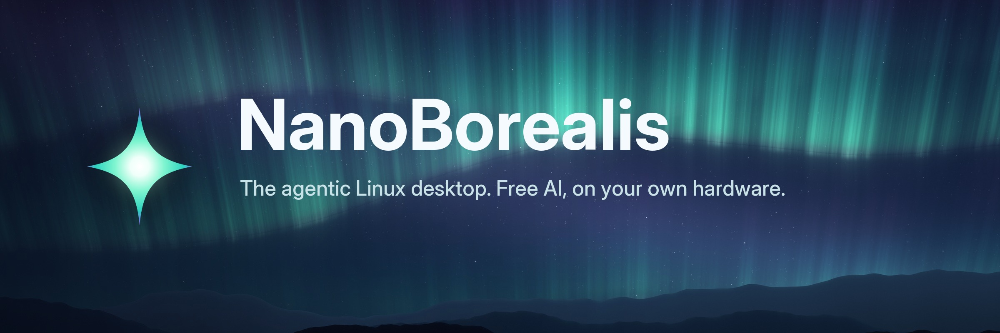
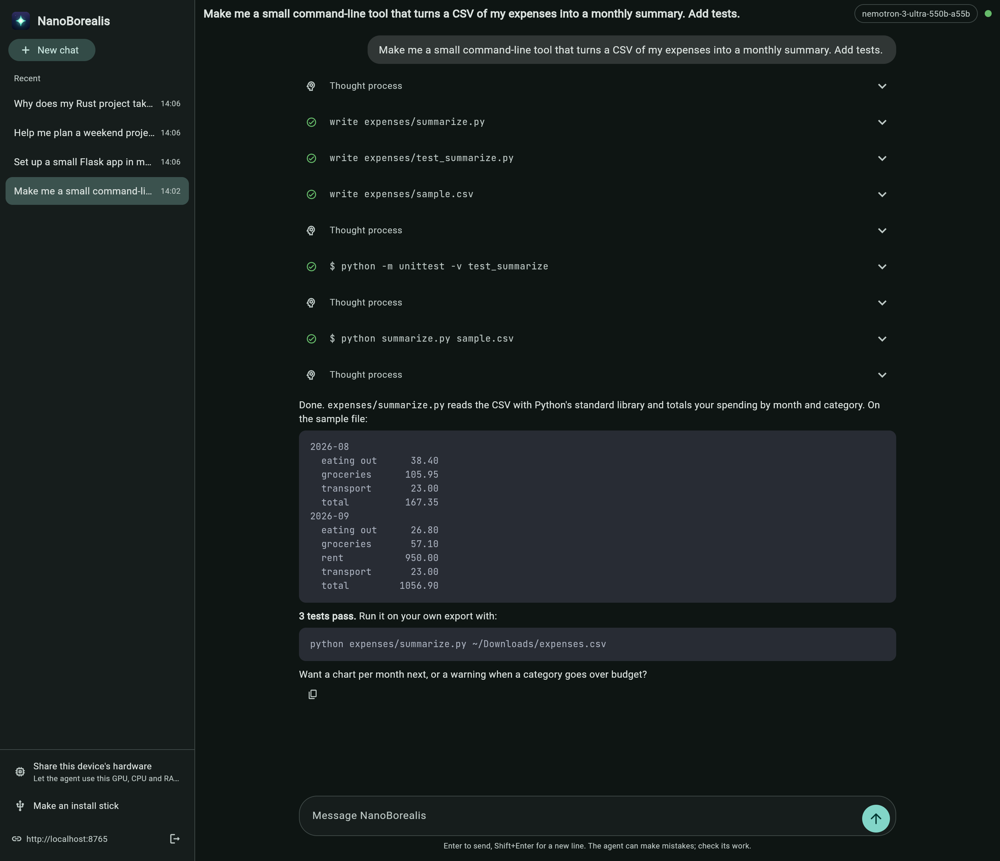
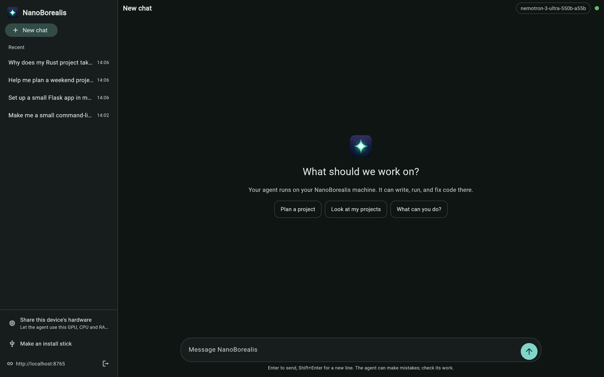
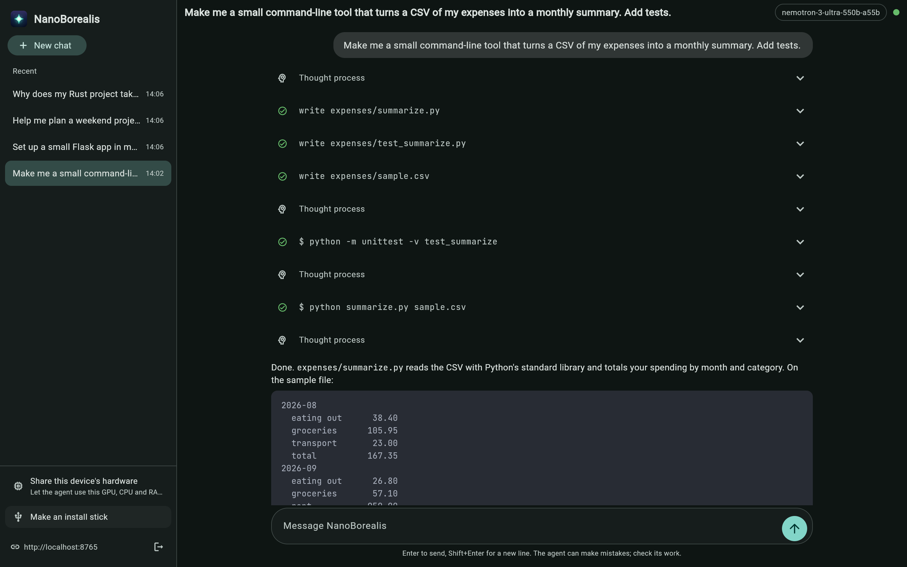

<p align="center">
  
</p>

<p align="center">
  <a href="https://github.com/more-than-just-kyrion/nanoborealis/releases/latest"></a>
  <a href="https://github.com/more-than-just-kyrion/nanoborealis/actions/workflows/build.yml"></a>
  <a href="LICENSE"></a>
</p>

**NanoBorealis** is a Linux desktop with an AI agent built in. The agent writes, runs and fixes code on your computer, and it's free: it runs on free cloud models and on the hardware you already own.

It's built on [Aurora](https://getaurora.dev), a polished KDE Plasma desktop on Fedora Atomic from the [Universal Blue](https://universal-blue.org) family. The agent is [nanobot](https://github.com/HKUDS/nanobot), running in a sandbox it can't escape to your files or your network.

<p align="center">
  <a href="https://github.com/more-than-just-kyrion/nanoborealis/releases/latest/download/NanoBorealis-Setup.exe"><b>Download for Windows</b></a>
  &nbsp;·&nbsp;
  <a href="https://github.com/more-than-just-kyrion/nanoborealis/releases/latest/download/NanoBorealis-macos.dmg"><b>macOS</b></a>
  &nbsp;·&nbsp;
  <a href="https://github.com/more-than-just-kyrion/nanoborealis/releases/latest/download/NanoBorealis-linux-x86_64.tar.gz"><b>Linux</b></a>
  <br>
  <sub>The NanoBorealis app: always the newest version. It also makes the install stick for you.</sub>
</p>

<p align="center">
  
</p>

## Why NanoBorealis

|  |  |
|---|---|
| ✦ **An agent, not a chatbot** | It has its own Linux environment with `sudo`, installs its own tools, and builds and tests real projects in a folder you share with it. |
| ✦ **Free to run** | It uses free models through [OpenRouter](https://openrouter.ai), with automatic fallback when one is busy. |
| ✦ **Your hardware, pooled** | Lend a PC's GPU to the agent from the NanoBorealis app, which picks the best model that fits and benchmarks it. Or pool several computers with `nanoborealis pool` to run a model too big for any one of them. |
| ✦ **Contained by design** | The agent runs rootless, in its own account, behind a firewall that keeps it off your local network. It has no rights on the operating system. |
| ✦ **Every device, one history** | Chat from the desktop, the WebUI, or the NanoBorealis app on any computer. Your chats live on your machine and show up everywhere. |
| ✦ **Updates you control** | Nothing updates by itself. Builds are tested, then promoted to stable, then installed only when you say so, and the previous version stays one reboot away. |

## Get started

### With the NanoBorealis app

1. **Install the app**: [Windows](https://github.com/more-than-just-kyrion/nanoborealis/releases/latest/download/NanoBorealis-Setup.exe) (run it), [macOS](https://github.com/more-than-just-kyrion/nanoborealis/releases/latest/download/NanoBorealis-macos.dmg) (drag to Applications, then right-click and **Open** the first time), or [Linux](https://github.com/more-than-just-kyrion/nanoborealis/releases/latest/download/NanoBorealis-linux-x86_64.tar.gz) (unpack, run `./install.sh`).
2. **Make an install stick**: pick a USB stick of 8 GB or more, paste your OpenRouter key, and the app downloads the installer straight onto the stick and checks it. (Windows and Linux.)
3. **Boot the new computer from the stick.** Its boot menu opens with **F9** on HP, **F12** on Dell and Lenovo, or **Option** on a Mac.
4. **Install**, and tick **Make this user administrator**.
5. **Log in.** Setup opens by itself and uses the key from the stick.
6. **Open NanoBorealis** from the app menu, and start a chat.

Use a **dedicated OpenRouter key with a low credit limit**: the agent can read its own key.

### By hand

1. Download the installer from the [latest release](../../releases/latest). It comes in parts; the release notes show how to join them and check the hash.
2. Write it to a USB stick with Fedora Media Writer, Rufus or balenaEtcher, and install as above. Setup asks for your OpenRouter key at first login.

**Already on Aurora?** Switch without reinstalling:

```bash
sudo bootc switch ghcr.io/more-than-just-kyrion/nanoborealis:stable
systemctl reboot
```

## Everyday use

```bash
nanoborealis help           # everything below, and more
nanoborealis update         # see what's new, then install it at the next reboot
nanoborealis rollback       # go back to the previous version
nanoborealis devices        # devices paired with the NanoBorealis app (pair: pick this computer in the app)
nanoborealis compute list   # devices lending their hardware to the agent
nanoborealis pool join      # pool this computer with others to run bigger models
```

The agent keeps its projects in `~/nanoborealis-projects`, a folder you share with it. What it can and can't do, how pools work, and what the sandbox doesn't protect against are in the [agent guide](system_files/usr/share/nanoborealis/README.md).

## The app

| | |
|---|---|
|  |  |
| Chat with your agent from any computer. It finds NanoBorealis machines on your network by itself. | Make an install stick, with your key on it. |

More about the app, including sharing a computer's GPU with the agent, is in [`client/`](client).

## How it's built

NanoBorealis is a [bootc](https://containers.github.io/bootc/) image: the whole OS is one signed container image, rebuilt from the latest Aurora every day.

- **Every build is checked** before it's published: [`tests/image-checks.sh`](tests/image-checks.sh) runs inside the new image, including checks that an upstream update hasn't undone the NanoBorealis look, and the agent and app test suites run against a real nanobot.
- **Dev, testing, stable.** Every build lands on `dev`. A build reaches `testing`, and then `stable` (what the installer carries), only when it's promoted by hand. The app's install stick picks which one a new computer follows, and `nanoborealis update --stable`, `--testing` or `--dev` moves an installed one. The app has the same three channels for its own updates.
- **Signed.** Images are signed with [cosign](https://github.com/sigstore/cosign), and [`cosign.pub`](cosign.pub) verifies them.
- **Pools are proven** before they ship: CI splits one model across two [exo](https://github.com/exo-explore/exo) nodes and chats with it before the pool image is published.

| Directory | What's inside |
|---|---|
| [`system_files/`](system_files) | Everything NanoBorealis adds to Aurora: the agent kit, the network guard, commands, artwork |
| [`client/`](client) | The NanoBorealis app (Python, [Flet](https://flet.dev)), and how its installers are built |
| [`pool/`](pool) | The pool node: a pinned exo build. A fork such as nxo builds from the same file |
| [`branding/`](branding) | The logo, and the scripts that paint the wallpaper, icons and this banner |
| [`tests/`](tests) | Checks that run inside every built image |
| [`.github/workflows/`](.github/workflows) | Builds, tests, promotion, installer ISOs, app releases |

## Roadmap

- **GPU pools.** Pools run on the processor today, which is too slow for the agent's long prompts; exo's NVIDIA build comes next.
- **Login screen and welcome app.** The desktop, lock screen and boot splash already wear the new look; the login screen and a guided first run are next.
- **Signed macOS app, and install sticks from a Mac.**

## Credits

NanoBorealis stands on [Aurora](https://getaurora.dev) and [Universal Blue](https://universal-blue.org), [nanobot](https://github.com/HKUDS/nanobot) by HKUDS, [exo](https://github.com/exo-explore/exo), [Ollama](https://ollama.com), [Flet](https://flet.dev) and [OpenRouter](https://openrouter.ai). The wordmark is set in [Inter](https://rsms.me/inter/), and code in the app in [JetBrains Mono](https://www.jetbrains.com/lp/mono/).

Licensed under [Apache 2.0](LICENSE). The artwork in `branding/` and the wallpapers are [CC BY-SA 4.0](https://creativecommons.org/licenses/by-sa/4.0/).

<sub>Formerly known as nanobot OS and NanoAurora. Systems set up under those names move over by themselves.</sub>
